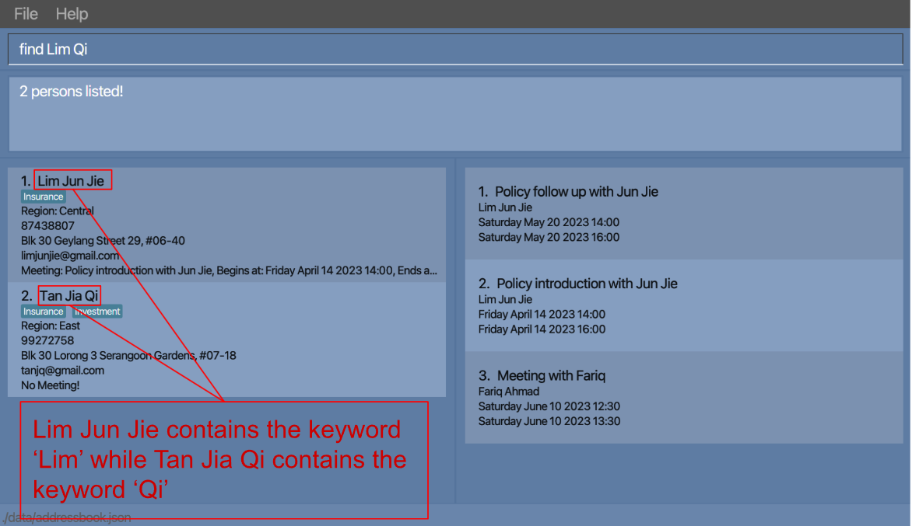
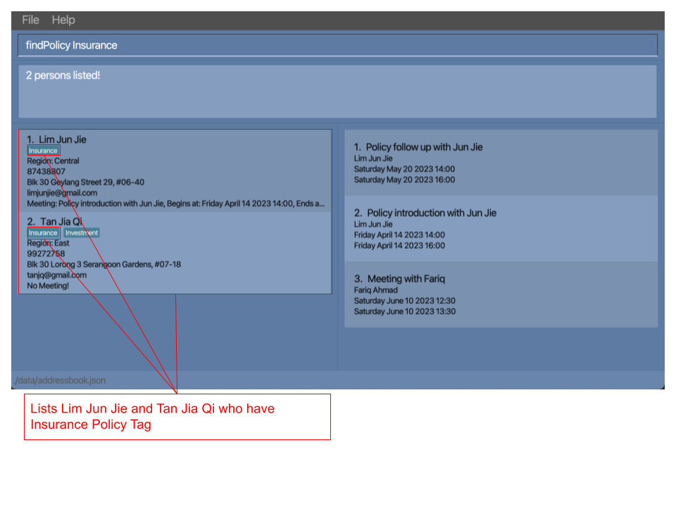
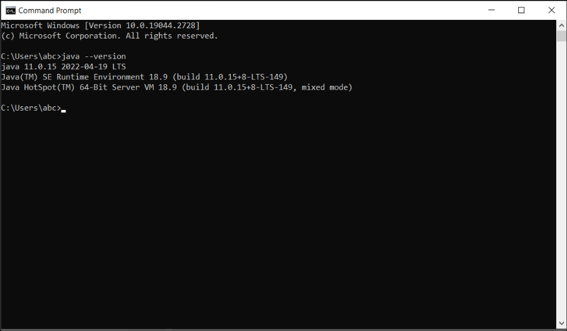

FAid is a **client and schedule management** application made for financial advisors!
Financial advisors can use FAid to easily **save their client information** and **organise meetings**.
With FAid, financial advisors will no longer have to worry about missing a meeting or forgetting a client!

## Table of Contents
* Table of Contents
{:toc}
--------------------------------------------------------------------------------------------------------------------
## About this User Guide

### How to use this guide?

If you are new to FAid, don't worry! This guide will walk you through the [basic setup](#quick-start) necessary to get you ready to use FAid.

Additionally, this guide provides you with in-depth information on the functionality FAid provides, which will turn you into a FAid pro in the [features](#features) section.

For experienced users of FAid, this guide also provides a [command summary](#command-summary) for your reference, so you can quickly look up all of FAid's core commands at one glance.

### Reading the document

This guide utilizes symbols and syntax to highlight certain points made throughout the guide and enhance your overall reading experience. The section below provides meaning of the symbols used for your reference.

### General symbols used

This table describes the main symbols used in this user guide and their meanings.

Symbol | Meaning
--------|------------------
:exclamation: | Indicates warnings (take caution when you see this symbol)
:grey_question: | Frequently asked questions
:information_source: | Important information to take note

--------------------------------------------------------------------------------------------------------------------

## Quick start
FAid requires `Java 11` to function.
Unsure if you have `Java 11`, or you don't have it? Refer to the [Troubleshooting section](#troubleshooting) for help!
Otherwise, refer to the following steps to get started.

1. Download the application called `faid.jar` from this [link](https://github.com/AY2223S2-CS2103T-W12-3/tp/releases).

1. Double click the `faid.jar` file you downloaded and the app should launch automatically. 
   If this is your first time using a .jar file, see the [Troubleshooting section](#troubleshooting) for help.

1. The application should look like this. To begin, type in any command in the command box
and press Enter to execute it.

**:grey_question: Unsure of what commands there are?:** 
Refer to the [Features](#features) below for details of each command.

[Back to the top](#table-of-contents)

--------------------------------------------------------------------------------------------------------------------

## Features
**If this is your first time using FAid, this is what the app provides you with and how to use it**

**:information_source: Notes about the command format:** 

* Words in `UPPER_CASE` are the parameters to be supplied by you. 
  e.g. in `add n/NAME`, `NAME` is a parameter which can be used as `add n/John Doe`.

* Items in square brackets are optional. 
  e.g `n/NAME [t/TAG]` can be used as `n/John Doe t/friend` or as `n/John Doe`.

* Items with `…`​ after them can be used multiple times including zero times. 
  e.g. `[t/TAG]…​` can be used as ` ` (i.e. 0 times), `t/friend`, `t/friend t/family` etc.

* Parameters can be in any order. 
  e.g. if the command specifies `n/NAME p/PHONE_NUMBER`, `p/PHONE_NUMBER n/NAME` is also acceptable.

* If a parameter is expected only once in the command but you specified it multiple times, only the last occurrence of
  the parameter will be taken. 
  e.g. if you specify `p/12341234 p/56785678`, only `p/56785678` will be taken.

* Extraneous parameters for commands that do not take in parameters (such as `help`, `list`, `exit` and `clear`) will be
  ignored. 
  e.g. if the command specifies `help 123`, it will be interpreted as `help`.

* `CLIENT_INDEX` refers to index number showed in displayed client list

* `MEETING_INDEX` refers to index number of meeting showed in displayed meeting list of specified client. 
   e.g index of meetings found from list shown by `meetingFind` command

* Index must be a positive number

* Meetings displayed when app is opened initially are those meetings for the current day, and your input of 'listMeeting' is required to list all meetings stored in FAid

* `ARG1|ARG2` in format means only one ARG1 or ARG2 must be a part of your input but not both

* Refer to the [Prefix Masterlist](#prefix masterlist) for the list of prefixes used for the commands below.

### Viewing help : `help`

Shows a message explaining how to access the help page.

Format: `help`

### Adding a client : `add`

Adds a client to FAid.

Format: `add n/NAME p/PHONE_NUMBER e/EMAIL a/ADDRESS [t/TAG]…​`

:bulb: **Tip:**
A client can have any number of tags (including 0)

Required Information:
* `NAME`: Name of a client whose contact is to be stored in FAid
* `PHONE_NUMBER`: Phone number of a client whose contact is to be stored in FAid, which must be a valid number with 8 digits and starts with 6, 8 or 9
* `EMAIL`: A valid email of a client whose contact is to be stored in FAid
* `TAGS`: Optional labels to put for clients, such as tagging which policy they bought or are interested in buying

Examples:

* `add n/Cindy Lim p/98765432 e/cindyl@gmail.com a/Bishan, block 24, #04-01` adds a client named Cindy Lim with
her phone number, email and address
* `add n/Betsy Crowe e/betsycrowe@outlook.com a/Ang Mo Kio p/99766389 t/Insurance` adds a client named
Betsy Crowe with her phone number, email and address, as well as the financial policy she is under, Insurance.

Note:
* The tag used to add a person into the contact list will be used in the findPolicy method, e.g. using the above example, doing a findPolicy Insurance will show Betsy Crowe

### Listing all clients : `listPerson`

Shows a list of all clients in FAid.

Format: `listPerson`

### Editing a client : `edit`

Edits information of an existing client in FAid.

Format: `edit INDEX [n/NAME] [p/PHONE] [e/EMAIL] [a/ADDRESS] [t/TAG]…​`

* Edits the client at the specified `INDEX`. The index refers to the index number shown in the displayed client list.
  The index **must be a positive integer** 1, 2, 3, …​
* At least one of the optional fields must be provided.
* Existing values will be updated to the input values.
* When editing tags, the existing tags of the client will be removed i.e adding of tags is not cumulative.
* You can remove all the client’s tags by typing `t/` without specifying any tags after it.

Examples:

* `edit 1 p/91234567 e/johnd@gmail.com` Edits the phone number and email address of the 1st client to be `91234567`
  and `johnd@gmail.com` respectively.
* `edit 2 n/Betsy Crower t/` Edits the name of the 2nd client to be `Betsy Crower` and clears all existing tags.

### Locating clients by name: `find`

Finds clients whose name is any of the given keywords.

Format: `find KEYWORD [MORE_KEYWORDS]`

* The search is case-insensitive. e.g `lim` will match `Lim`
* The order of the keywords does not matter. e.g. `Jun Jie` will match `Jie Jun`
* Only the name is searched.
* Only full words will be matched e.g. `Ro` will not match `Rohit`
* clients matching at least one keyword will be returned (i.e. `OR` search). e.g. `Lim Qi` will return `Lim Jun Jie`
  , `Tan Jia Qi`

Examples:

* `find lim jun jie ` returns `Lim Jun Jie`
* `find Lim Qi` returns `Lim Jun Jie`, `Tan Jia Qi` 
  

### Deleting a client : `delete`

Deletes the specified client from FAid.

Format: `delete INDEX`

* Deletes the client at the specified `INDEX`.

Examples:

* `listPerson` followed by `delete 2` deletes the 2nd client in FAid.
* `find Fariq` followed by `delete 1` deletes the 1st client in the results of the `find` command.

### Add meeting : `meetingAdd`

Schedules a meeting with a client in FAid

Format: `meetingAdd CLIENT_INDEX md/DESCRIPTION ms/START me/END`

Required Information:
* `CLIENT_INDEX`: Index of a client in FAid
* `DESCRIPTION`: Description of the meeting to add
* `START`: Start date and time (Format: dd-mm-yyyy HH:MM)
* `END`: End date and time (Format: dd-mm-yyyy HH:MM)

Example:

* `meetingAdd 3 md/Meeting with Fariq ms/10-06-2023 12:30 me/10-06-2023 13:30` sets up a meeting on 10th June 2023
  from 12.30pm to 13.30pm, with Fariq Ahmad (index 3), with the description "Meeting with Fariq".

Notes:
* Meetings with the same client with overlapping times are not allowed but meetings with different clients at the same time are.
* Meeting must not conflict in timing with other meetings scheduled for the day.
* Meetings starting before the current time cannot be added.
* 

### Remove meeting : `meetingRemove`

Removes a specified meeting from FAid.

Format: `meetingRemove CLIENT_INDEX MEETING_INDEX`

Required Information:

* `CLIENT_INDEX`: Index of a client already in FAid
* `MEETING_INDEX`: Index of a meeting belonging to client at `CLIENT_INDEX`

Examples:

* `meetingRemove 20 6` Deletes the 6th meeting with the client of index 20.
* `meetingRemove 3 1` Deletes the 1st meeting with the client of index 3.

Note:
* Doing a `meetingFind CLIENT_INDEX` is necessary to get the `MEETING_INDEX` required. Refer to the meeting list shown
  by `meetingFind` to get the `MEETING_INDEX`

### Updating a meeting : `meetingUpdate`

Updates an existing meeting belonging to a client in FAid, so that financial advisors can be flexible
with their scheduling.

Format: `meetingUpdate CLIENT_INDEX MEETING_INDEX [md/DESCRIPTION] [ms/START] [me/END]`

Required Information:
* `CLIENT_INDEX`:Index of a client already in FAid
* `MEETING_INDEX`: Index of a meeting belonging to client at `CLIENT_INDEX`

Examples:
* `meetingUpdate 1 2 md/ Policy signing` Edits the meeting description of the 1st meeting belonging to the 1st client
  to `Policy signing`
* `meetingUpdate 2 3 md/ Plan review ms/ 30-03-2020 20:10 me/ 30-03-2020 22:10` Updates the description, start and end
  of the 3rd meeting belonging to the 2nd client to `Plan review`, `30-03-2020 20:10` and `30-03-2020 22:10`
  respectively

Notes:
* Edits the meetings of client at the specified `CLIENT_INDEX`.
* At least one of the optional fields must be provided.
* Existing values will be updated to the input values.
* Doing a `meetingFind CLIENT_INDEX` is necessary to get the `MEETING_INDEX` required. Refer to the meeting list shown
by `meetingFind` to get the `MEETING_INDEX`  

### Find meeting : `meetingFind`

Finds meetings from FAid based on the date of meeting or person index but not both

Format: `meetingFind DATE|CLIENT_INDEX `

Required Information:

* Date (dd/mm/yyyy)
* Index of a client that is already stored in FAid.

Examples:
* `meetingFind 11/05/2023` Lists out all meetings that start on 11th May 2023
* `meetingFind 5` Lists out all meetings with client of index 5 in FAid

### List meeting : `listMeeting`

Lists all meetings scheduled in FAid

### List by region : `listRegion`

Lists all clients living in a given region, currently works for North, South, East, West, Central and Unknown

Required information:

* Region to search for
* Region specified should be a valid region

Examples:
* `listRegion Central` lists all clients from the Central region in FAid.

### Find clients by policy name : `findPolicy`

Lists all clients that are under a given policy

Format: `findPolicy POLICY_NAME [MORE_POLICY_NAMES]`
* The search is case-sensitive. e.g `insurance` will not match `Insurance`

Required information:

* Name of policy to search for, which is in the client's tags

Examples:

* `findPolicy Insurance` Find clients with Insurance as their tag

### Clearing all entries : `clear`

Clears all entries from FAid.

Format: `clear`

:exclamation: <b>Caution:</b>
Executing clear will result in all of your client information and meetings to be cleared permanently!

### Exiting the program : `exit`

Exits the program.

Format: `exit`

### Saving the data

FAid data are saved in the hard disk automatically after any command that changes the data. There is no need to save
manually.

### Editing the data file

FAid data are saved as a JSON file `[JAR file location]/data/addressbook.json`. If you are an advanced user, you are welcome to update
data directly by editing that data file.

:exclamation: <b>Caution:</b>
If your changes to the data file makes its format invalid, FAid will discard all data and start with an empty data file at the next run.

[Back to the top](#table-of-contents)

--------------------------------------------------------------------------------------------------------------------

## FAQ

**Q**: How do I transfer my data to another Computer? 
**A**: Install the app in the other computer and overwrite the empty data file it creates with the file that contains
the data of your previous FAid home folder.

**Q**: How do I key in my client's region? 
**A**: FAid automatically detects region based on address keyed in

[Back to the top](#table-of-contents)

--------------------------------------------------------------------------------------------------------------------

## Troubleshooting

### Installing Java 11
1. Download `Java 11` using this [link](https://www.oracle.com/sg/java/technologies/javase/jdk11-archive-downloads.html) 
2. To check if `Java 11` is installed successfully, first open command prompt. Refer to the following
   image on how to do this.
   
3. Inside command prompt, type in `java --version` and press enter. Your output should look like this:

4. If your output matches the image above, `Java 11` has been installed successfully!
5. If java is not installed correctly, you could see an error message like this:  
`'java' is not recognized as an internal or external command, operable program or batch file.`  
Please refer to this [link](https://www.theserverside.com/blog/Coffee-Talk-Java-News-Stories-and-Opinions/Java-Not-Recognized-Error-Fix) for more help!

### Checking if Java 11 is installed
To check if you have Java `11` installed and configured correctly, refer to steps 2-4 of `Installing Java` under
Troubleshooting!

[Back to the top](#table-of-contents)

--------------------------------------------------------------------------------------------------------------------

## Prefix Masterlist

Prefix | Field
--------|------------------
**n/** | Name
**p/** | Phone number
**e/** | Email address
**a/** | Residential Address
**t/** | Policy Tag Name
**md/** | Description of meeting
**ms/** | Start date and time of meeting
**me/** | End date and Time of meeting

[Back to the top](#table-of-contents)

--------------------------------------------------------------------------------------------------------------------

## Command summary

Action | Format, Examples
--------|------------------
**Add** | `add n/NAME p/PHONE_NUMBER e/EMAIL a/ADDRESS [t/TAG]…​`   e.g, `add n/James Ho p/22224444 e/jamesho@example.com a/123, Clementi Rd, 1234665 t/friend t/colleague`
**Clear** | `clear`
**Delete** | `delete INDEX` e.g., `delete 3`
**Edit** | `edit INDEX [n/NAME] [p/PHONE_NUMBER] [e/EMAIL] [a/ADDRESS] [t/TAG]…​`   e.g.,`edit 2 n/James Lee e/jameslee@example.com`
**Find** | `find KEYWORD [MORE_KEYWORDS]`   e.g., `find James Jake`
**List all persons** | `listPerson`
**Help** | `help`
**Add Meeting** | `meetingAdd CLIENT_INDEX md/ DESC ms/ START DATE&TIME me/ END DATE&TIME`
**Remove Meeting** | `meetingRemove CLIENT_INDEX MEETING_INDEX`
**Find Meeting** | `meetingFind DATE\|CLIENT_INDEX`
**List all meetings** | `meetingList`
**List all in Region** | `listRegion REGION`
**Find Policy** | `findPolicy POLICY_NAME [MORE_POLICY_NAMES]`

[Back to the top](#table-of-contents)
